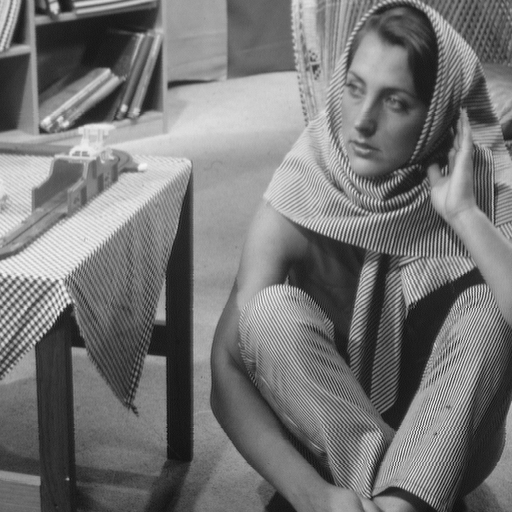

# NPPFilter
This is a Nvidia Performance Premitives project

## Project Description

The project is implementing an example of using NPP to apply a box filter to a set of input images located under data/ and save the filtered images under output/

## Code Organization

```bin/```
This folder contains the executable files.

```data/```
This folder contains the input images to the filter.

```output/```
The output images after fitlering should reside here.

```src/```
The source code files.

## Build/Run Instructions
by executing the shell script:

./run.sh


alternatively, make can be called directly to d so like:

make clean build

make run

## Data Sample

